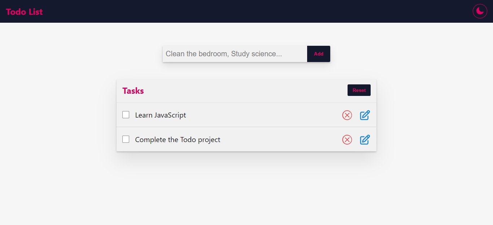

# ToDo App



The ToDo app is a simple task management application that helps you keep track of your tasks and stay organized. With this app, you can create, edit and delete your tasks.

## Features

- Dark/Light Mode: Personalize the app by switching between dark and light themes.

- Add Tasks: Easily create new tasks by providing a description.

- Edit Tasks: Update existing tasks by modifying their descriptions.

- Complete Tasks: Mark tasks as completed.

- Delete Tasks: Remove tasks that are no longer relevant or necessary.

- Reset Task List: Start fresh by resetting the entire task list. This option allows you to clear all tasks.

## Run Localy

You will need to have Node.js installed and have access to a terminal to follow the steps below:

#### 1. Install dependencies

```
npm install
```

#### 2. Set up the project

```
npm run dev
```
